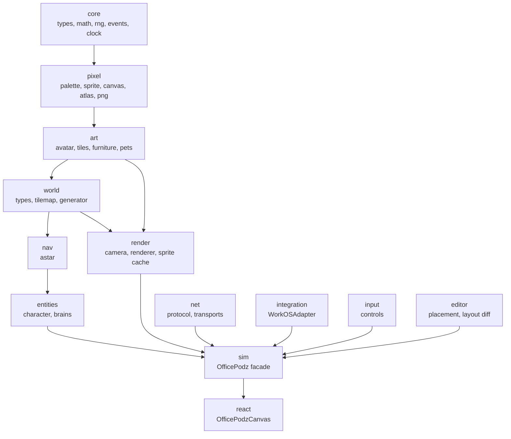
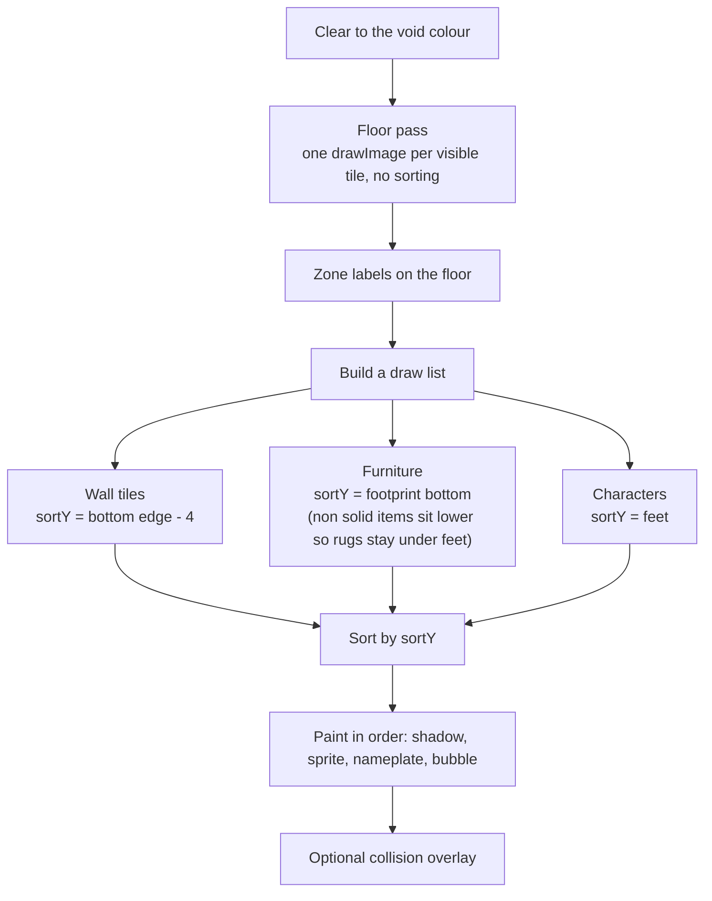
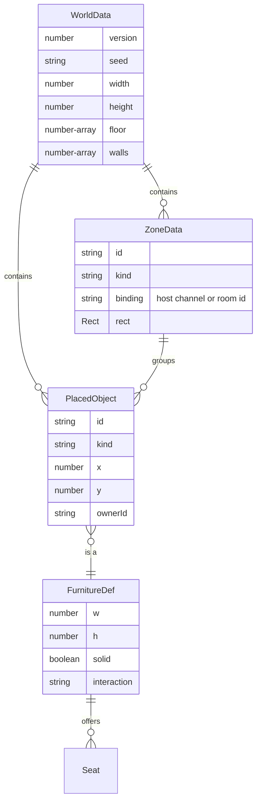
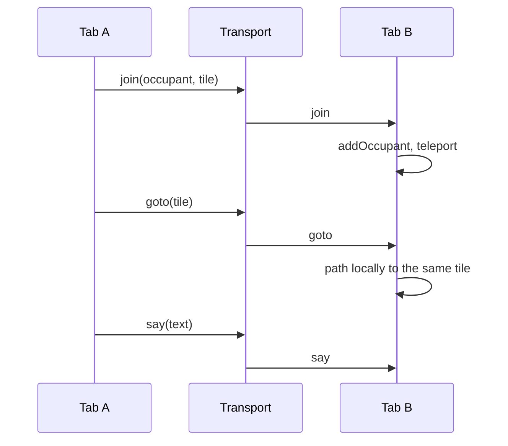
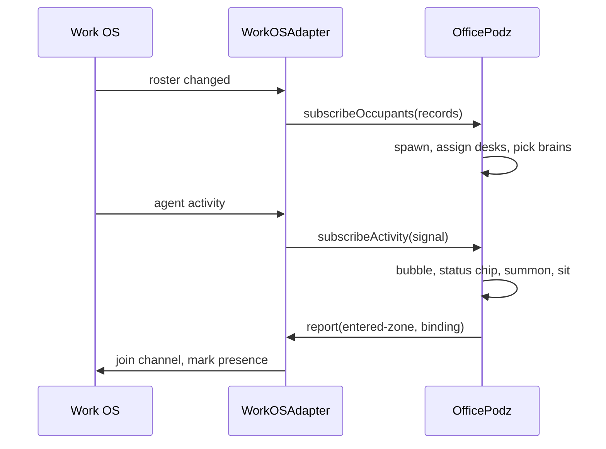

# Architecture

How OfficePodz is put together, and why it is put together that way.

---

## 1. Module graph

Dependencies point one way only. Nothing below reaches up.



The practical consequence: you can import `art` alone to bake sprites in a build script, or `world`
alone to generate a floor plan on a server, without pulling in a canvas.

---

## 2. Coordinate systems

Three of them, and mixing them up is the most common bug in this kind of engine, so they are named
consistently everywhere.

```
  tile        integer grid units. Pathfinding, collision, furniture footprints.
              ▼
  world       floating point pixels inside the map. Characters live here.
              1 tile = TILE_SIZE (16) world pixels.
              ▼
  screen      device pixels after the camera transform and integer zoom.
```

```
      world pixels                         screen pixels
   ┌───────────────────┐                ┌─────────────────┐
   │ ┌──┐              │   camera       │                 │
   │ │  │ character    │  ──────────►   │   ┌──┐          │
   │ └──┘ at feet      │  zoom x3       │   │  │          │
   │                   │  origin round  │   └──┘          │
   └───────────────────┘                └─────────────────┘
```

A character's position is stored at its **feet**, not its top left. That single choice makes depth
sorting, shadow placement and tile occupancy all fall out for free: the feet are the thing that is
actually standing on a tile.

Zoom is always an integer, and the camera origin is rounded at draw time rather than during the
update. Smoothing stays smooth, output stays crisp, and no sprite ever lands on a half pixel.

---

## 3. The tick

```
  requestAnimationFrame
        │
        ├── accumulate delta, capped at 250 ms   (a backgrounded tab must not spiral)
        │
        ├── while accumulator >= 1/30:
        │       update(1/30)
        │         ├── brains decide          (directive queue, then idle behaviour)
        │         ├── characters move        (walk the A* path, advance the pose)
        │         ├── zone tracking          (entered / left, reported to the host)
        │         └── camera follows         (deadzone, exponential damping)
        │
        └── render(alpha, elapsed)
```

Fixed timestep for simulation, free running for rendering. Agent behaviour and network replay are
reproducible; frame rate is not part of the model.

---

## 4. The render pipeline



Everything that can occlude anything else goes into one list keyed by its bottom edge. That is the
whole occlusion system. A desk drawn 26 pixels tall on a 16 pixel footprint rises up the wall behind
it, and a person standing in front of it covers it, because the person's feet are lower.

**Sprites carry their own palettes.** Every avatar is a palette swap of one template, so compositing
has to happen in colour space, not in palette index space. The browser renderer gets this for free
because each sprite is baked to its own canvas before it is drawn. Headless tooling has to do it
explicitly, which is what `RgbaCanvas` in `scripts/lib.mjs` is for.

### Sprite caching

The cache is keyed by the **resolved appearance**, not by character id:

```
av:{skin}:{hair}:{hairStyle}:{outfit}:{trousers}:{accent}:{eye}:{direction}:{pose}
```

A hundred people wearing eight outfits cost eight bakes per direction and pose, not a hundred.

---

## 5. The art system

```mermaid
flowchart LR
  templates["Hand authored templates<br/>16x22 strings, 12 palette slots"]
  style["AvatarStyle<br/>derived from an id hash"]
  palette["avatarPalette()<br/>slots resolved to hex"]
  sprite["PixelSprite<br/>JSON: palette + rows"]
  canvas["HTMLCanvasElement"]
  atlas["PNG atlas + JSON manifest"]

  templates --> sprite
  style --> palette --> sprite
  sprite --> canvas
  sprite --> atlas
```

Avatars are hand authored because a procedural face does not read at 16 pixels. Everything else,
furniture, pets and tiles, is drawn with `PixelBuffer` primitives: fewer characters to get wrong, and
a theme becomes a set of colour arguments rather than a redraw.

Templates use twelve slots rather than literal colours:

```
0 transparent   1 outline      2 skin        3 skin shadow
4 hair          5 hair shadow  6 shirt       7 shirt shadow
8 trousers      9 shoes        a eye         b accent
```

Rows 0 to 16 are the body, rows 17 to 21 come from a leg frame. Swapping the leg frame is the entire
animation system, which is why the walk cycle and the seated pose exist without a second torso.

---

## 6. The world



`WorldData` is plain JSON with no classes in it. `Tilemap` is the runtime view: it owns the collision
grid, the zone lookup and the object index, and it rebuilds collision in a single pass after any
edit. At these sizes, a few thousand tiles, that costs nothing and removes a whole class of stale
index bug.

### Generation

```
1. Lay the corridor and wall it.
2. Place rooms in two rows, sharing walls, one door each onto the corridor.
3. Paint each room's floor by kind and furnish it from a per kind furnisher.
4. Dress the corridor last, so a plant never lands in a doorway.
5. Spawn in the middle of the corridor.
```

Everything is seeded. Hosts persist a seed plus a layout diff rather than a whole map.

---

## 7. Pathfinding

Grid A*, four way, with a linear scan open set.

Diagonals are deliberately off. Characters are 16 pixels wide, and cutting a corner diagonally clips
furniture the collision grid says is solid. Four way movement also makes the walk cycle read
correctly, because every step maps to exactly one facing.

Other standing characters are **soft** obstacles with a cost of 4 rather than hard blocks, so a
crowd in a corridor flows around itself instead of deadlocking.

The open set is an array with a linear minimum scan. For a few thousand tiles that beats the
allocation cost of a binary heap, and it keeps the file readable. If maps grow past roughly 200x200,
this is the first thing to replace.

---

## 8. Presence and the network



Movement travels as a **target tile**, not a stream of positions. A peer that drops packets still
ends up in the right place, and bandwidth is flat regardless of frame rate. Each client paths
locally, so the walk looks right even on a slow link.

Three transports ship:

| Transport | Use |
|-----------|-----|
| `LoopbackTransport` | Single player, tests, storybook. Removes the "there is no network" branch from the engine. |
| `BroadcastTransport` | Two tabs on one origin become two people in one office, with no server at all. |
| `BridgeTransport` | Wraps a socket, a Convex subscription, a Firebase channel or a Liveblocks room you already run. |

---

## 9. The host seam



Six methods. The engine never queries a database, never owns identity, and never decides what an
agent is doing. It reports where bodies went and what they bumped into.

---

## 10. Decisions worth knowing about

| Decision | Reason |
|----------|--------|
| Top down, not isometric | Isometric doubles the art cost and makes tile maths a translation layer. Top down reads instantly at 16px. |
| Feet as the position anchor | Depth sorting, shadows and tile occupancy all follow from it. |
| Integer zoom only | Fractional zoom on pixel art produces shimmer that no amount of smoothing fixes. |
| Sprites as JSON, not PNG, in source | Reviewable diffs. PNGs are a build artefact, baked by `npm run assets`. |
| Hand written PNG encoder | Keeps the package dependency free. Node build scripts pass `zlib.deflateSync` for small committed assets; the browser path falls back to stored blocks. |
| Fixed 30 Hz simulation | Reproducible behaviour and replayable network state. |
| Soft character collisions | Crowds flow. Hard collisions deadlock corridors. |
| Pets report nothing | Life without meaning that has to be kept accurate. |
| No purple, enforced in CI | A host brand rule, encoded as `scripts/check-palette.mjs` rather than as a comment nobody reads. |

---

## 11. Where the seams are for extension

| You want to | Start at |
|-------------|----------|
| Add furniture | `src/art/furniture.ts`, add a `FurnitureDef` with a `draw` function |
| Add a pet | `src/art/pets.ts`, add a drawer and a colour set |
| Re-theme the office | `src/pixel/palette.ts` plus the `FLOOR_BY_KIND` map in the generator |
| Use your own floor plan | Pass `rooms` to `generateOffice`, or hand write `WorldData` |
| Change how agents behave | Implement `Brain`, register it instead of `AgentBrain` |
| Render somewhere other than canvas | `Renderer` is the only file that touches the DOM. The simulation does not. |
| Drive your own loop | `autoStart: false`, then call `engine.update(dt)` yourself |
