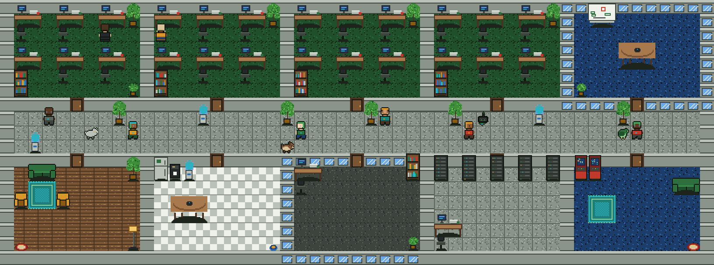
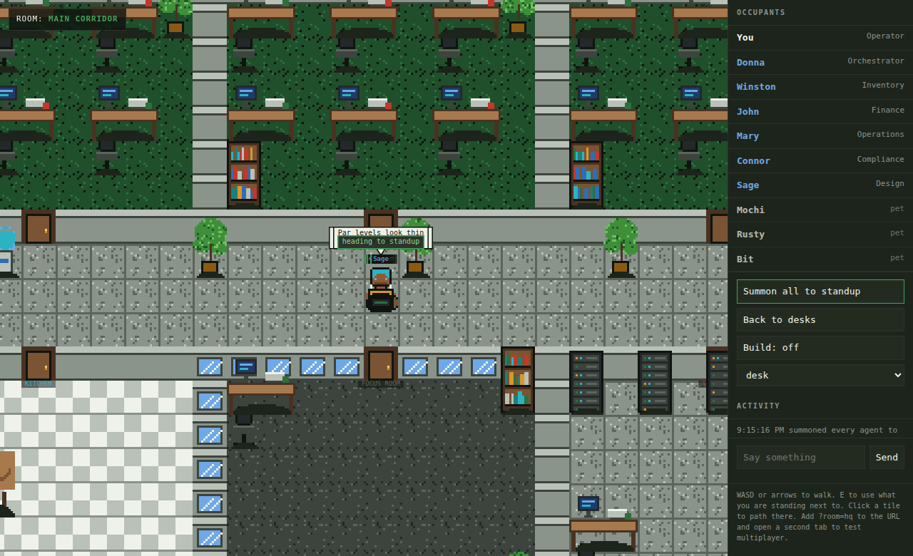
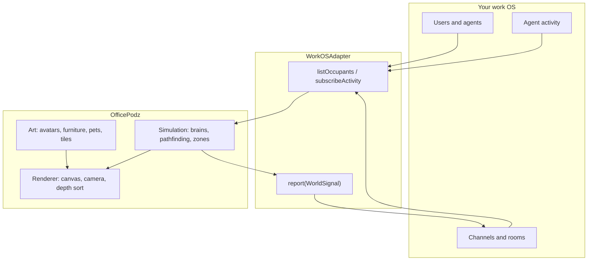
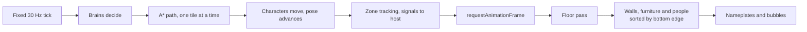
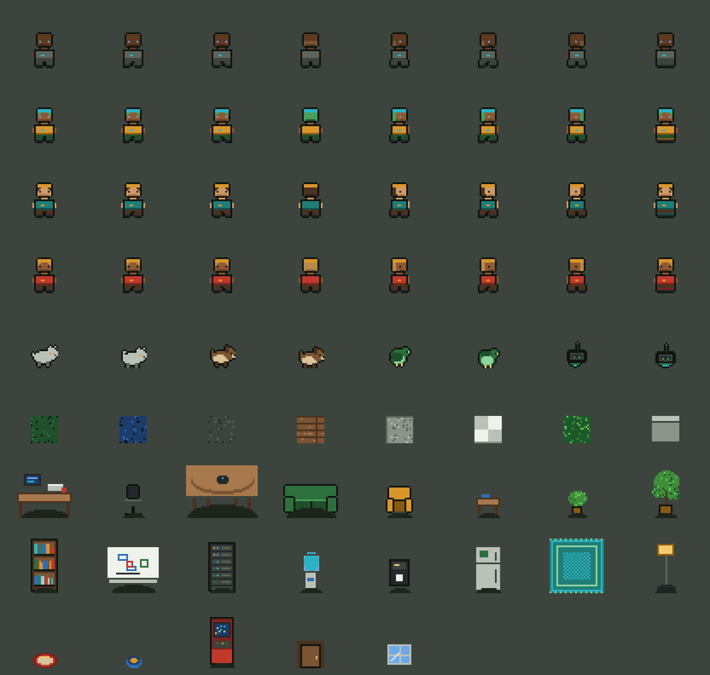

# OfficePodz

A pixel art office that drops into a work operating system you have already built.

You have the interface: the chat, the boards, the agents, the dashboards. What is missing is the
room. OfficePodz is the missing room. It brings the pixels, the sprites, the offices, the furniture,
the pets, the walking, the bumping into each other, and the small daily theatre that makes a team
feel like a team instead of a list of rows.



```
┌──────────────────────────────────────────────────────────────────────────────┐
│  YOUR WORK OS                              OFFICEPODZ                        │
│  ─────────────                             ──────────                        │
│  users, agents, presence      ──────►      avatars with faces and outfits    │
│  channels and rooms           ──────►      rooms you physically walk into    │
│  agent activity and status    ──────►      speech bubbles and status chips   │
│  tasks, desks, ownership      ──────►      a desk with your name on it       │
│                               ◄──────      "Mary just walked into #kitchen"  │
└──────────────────────────────────────────────────────────────────────────────┘
```

---

## What this is

A single TypeScript package with no runtime dependencies. It ships:

| Layer | What you get |
|-------|--------------|
| **Art** | A complete 16px pixel pack: avatars, 5 pets, 21 furniture pieces, 11 floor and wall tiles. Generated from code, exported as PNG atlases. |
| **World** | A procedural office generator, a tilemap with collision, rooms, doors, desks and zones. |
| **Simulation** | Four way pathfinding, a walk cycle, seating, autonomous agent and pet behaviour. |
| **Rendering** | A pixel perfect canvas renderer with depth sorting, a following camera, nameplates and speech bubbles. |
| **Presence** | A wire protocol plus three transports: loopback, cross tab, and a bridge to whatever realtime layer you already run. |
| **Integration** | One adapter interface that connects the whole thing to your existing users, agents and channels. |

It is **not** a game engine, not a video conferencing product, and not a second source of truth. It
renders the state your application already owns.

---

## Quick start

```bash
npm install          # nothing to install, there are no dependencies
npm run build        # tsc, emits dist/
npm run demo         # http://localhost:5173/examples/vanilla/
```

Then in your own app:

```ts
import { OfficePodz, createMockAdapter } from "@officepodz/core"

const engine = new OfficePodz({
  canvas: document.querySelector("canvas")!,
  adapter: createMockAdapter(),   // swap for your own adapter
  seed: "acme-hq",                // same seed, same office, every time
})

await engine.start()
```

React:

```tsx
import { OfficePodzCanvas } from "@officepodz/core/react"

<OfficePodzCanvas
  adapter={workOsAdapter}
  seed="acme-hq"
  style={{ height: "70vh" }}
  onZoneChanged={({ zoneId }) => setActiveChannel(zoneId)}
/>
```



---

## How it fits together



The adapter is the whole integration surface. Implement six methods and the office is populated with
your real team. Nothing else in the package reaches outside itself.

---

## The frame



Simulation runs at a fixed 30 Hz so behaviour is reproducible. Rendering runs as fast as the browser
allows. Walls join the same depth sorted list as people and furniture, which is what lets someone
walk behind a partition without a separate occlusion system.

---

## What is in the art pack



| Group | Contents |
|-------|----------|
| Avatars | 4 directions x 4 poses (stand, two walk frames, sit). Twelve palette slots, so one set of pixels makes every person and agent. |
| Pets | Cat, dog, bird, robot and plant pal. Three poses each, mirrored per direction. |
| Furniture | desk, chair, meeting table, sofa, armchair, coffee table, small plant, ficus, bookshelf, whiteboard, server rack, water cooler, coffee machine, fridge, rug, floor lamp, pet bed, pet bowl, arcade cabinet, door, window. |
| Tiles | Green, blue and grey carpet, wood, concrete, checker, grass, plus painted, glass and brick walls. |

Avatars are hand authored as pixel templates. Everything else is drawn procedurally with a small
pixel drawing API, so a whole office can be re-themed by changing colour indices instead of
redrawing sprites.

Sprites live in the repo as JSON, not as binary blobs, so art changes show up in code review as
readable diffs:

```
"...1442222441..."   4 = hair   2 = skin   1 = outline   . = transparent
"...12a2222a21..."   a = eye
```

Run `npm run assets` to bake PNG atlases plus JSON manifests into `assets/`, and `npm run sheet` to
regenerate the contact sheet above. `npm run preview` renders an entire office to a PNG with no
browser involved, which turns an art regression into an image diff in a pull request.

---

## The office

```
        ┌──────────┬──────────┬──────────┬──────────┬──────────┐
        │ Sourcing │ Kitchen  │ Commerce │Compliance│Boardroom │   <- pods and
        │          │   Ops    │          │          │          │      amenities
        └────┬─────┴────┬─────┴────┬─────┴────┬─────┴────┬─────┘
    ═════════╪══════════╪══════════╪══════════╪══════════╪═════════   <- corridor
        ┌────┴─────┬────┴─────┬────┴─────┬────┴─────┬────┴─────┐
        │  Lounge  │ Kitchen  │  Focus   │  Server  │  Games   │
        └──────────┴──────────┴──────────┴──────────┴──────────┘
```

Two rows of rooms either side of a central corridor, which is the shape almost every real office
converges on and which keeps every room one door away from circulation. Rooms share walls, so the
plan stays tight and the collision grid stays cheap.

```ts
const world = generateOffice({
  seed: "acme-hq",
  pods: 6,
  rooms: [                                   // or describe your real floor plan
    { name: "Platform", kind: "pod", binding: "channel:eng", capacity: 8 },
    { name: "Boardroom", kind: "meeting", binding: "channel:leadership" },
  ],
})
```

`binding` is the hook that matters: it is an opaque string handed back to you whenever someone walks
into the room. Put a channel id in it and walking into the boardroom joins the boardroom channel.

---

## Agents and pets

Agents are first class occupants, not decoration. They path, sit at assigned desks, gather when
summoned, and carry a status chip above their head.

```ts
engine.direct("agent-donna", { type: "goToZone", zoneId: "zone-4-meeting" })
engine.direct("agent-donna", { type: "status", text: "reviewing PR 214" })
engine.direct("agent-winston", { type: "sitAtDesk" })
engine.direct("agent-mary", { type: "follow", targetId: "viewer" })
```

The rule the brains follow: **a brain never invents facts about the business.** It decides where a
body should stand and when to idle. What an agent says and what it is working on comes from the host
through directives, so OfficePodz stays a presentation layer.

Pets are the opposite, and deliberately so. They orbit their owner, nap on the nearest bed, and
report nothing to anyone. They add life without adding meaning that has to be kept accurate.

---

## Documentation

| Document | What it covers |
|----------|----------------|
| [ARCHITECTURE.md](ARCHITECTURE.md) | Module graph, coordinate systems, render pipeline, tick order, the decisions and why |
| [docs/01-concepts.md](docs/01-concepts.md) | The nouns: occupants, zones, objects, directives, signals |
| [docs/02-integration.md](docs/02-integration.md) | Writing a real adapter, with a worked Convex and React example |
| [docs/03-sprite-spec.md](docs/03-sprite-spec.md) | The pixel format, palette slots, how to author a sprite by hand |
| [docs/04-world-format.md](docs/04-world-format.md) | WorldData on disk, persistence and layout diffs |
| [docs/05-agents-and-pets.md](docs/05-agents-and-pets.md) | Brains, directives, and how to write your own |
| [docs/06-asset-pipeline.md](docs/06-asset-pipeline.md) | Atlases, the PNG encoder, headless rendering, CI guards |
| [docs/07-extending-art.md](docs/07-extending-art.md) | Adding furniture, pets, tiles and themes |
| [docs/08-roadmap.md](docs/08-roadmap.md) | What is deliberately not built yet |

---

## Scripts

| Command | What it does |
|---------|--------------|
| `npm run build` | Compile to `dist/` |
| `npm run demo` | Serve the demo at http://localhost:5173/examples/vanilla/ |
| `npm run assets` | Bake PNG atlases and JSON manifests into `assets/` |
| `npm run preview` | Render a whole office to a PNG, headless |
| `npm run sheet` | Render the art contact sheet |
| `npm run world -- --seed acme --pods 6` | Generate and save a world as JSON |
| `npm run check:palette` | Fail the build on banned colours |
| `npm run check:art` | Validate every sprite the pack can produce |
| `npm run verify` | Build plus both guards |

---

## Constraints this package holds to

1. **No runtime dependencies.** It drops into any stack without dragging a tree behind it.
2. **No second source of truth.** Identity, membership and activity stay in the host.
3. **Deterministic.** The same seed produces the same office, so hosts persist a seed plus a diff.
4. **Data, not binaries.** Sprites and worlds are JSON. Art changes are reviewable.
5. **No purple.** The palette bans the 265 to 335 hue band, and CI enforces it.

## License

MIT. See [LICENSE](LICENSE).
