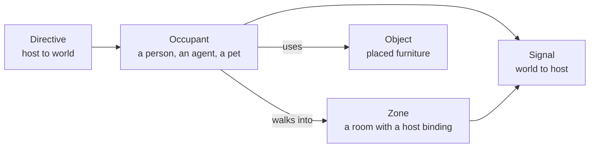

# Concepts

Five nouns. Everything in OfficePodz is one of them.



---

## Occupant

Anything with a body. Three kinds:

| Kind | Controlled by | Reports to host | Brain |
|------|---------------|-----------------|-------|
| `human` | The person at the keyboard, or a remote peer | Yes | None |
| `agent` | The host, through directives, plus idle behaviour | Yes | `AgentBrain` |
| `pet` | Itself | No | `PetBrain` |

An occupant reaches the engine as an `OccupantRecord`:

```ts
{
  id: "agent-winston",
  name: "Winston",
  kind: "agent",
  role: "Inventory",
  presence: "online",
  zoneId: "zone-1-pod",     // where it drifts when idle
  deskId: "obj-12",         // optional assigned desk
}
```

Leave `style` unset and the look is derived from a hash of the id. The same person gets the same
face, outfit and hair on every load, on every device, without storing anything.

### Presence

`online`, `busy`, `away`, `offline`, `thinking`. It colours the bar on the nameplate. `thinking` is
cyan and exists for agents mid task, because "this agent is working right now" is the single most
useful thing to see across a room.

---

## Zone

A rectangle of tiles with a name, a kind and, crucially, a **binding**.

```ts
{
  id: "zone-4-meeting",
  name: "Boardroom",
  kind: "meeting",
  rect: { x: 40, y: 0, w: 11, h: 8 },
  binding: "channel:leadership",   // opaque to OfficePodz
  capacity: 6,
}
```

The binding is never interpreted. It is handed straight back to you when someone crosses the
threshold:

```ts
adapter.report({ kind: "entered-zone", occupantId, zoneId, binding: "channel:leadership" })
```

Put a channel id in it and walking into the boardroom joins the boardroom channel. Put a meeting url
in it and walking in starts the call. Put nothing in it and the room is just a room.

Kinds: `pod`, `meeting`, `lounge`, `kitchen`, `focus`, `server`, `play`, `corridor`, `atrium`. The
kind picks the floor, the accent colour and which furnisher dresses the room.

---

## Object

A piece of furniture placed on the grid.

```ts
{ id: "obj-12", kind: "desk", x: 3, y: 2, ownerId: "agent-winston", zoneId: "zone-0-pod" }
```

Each kind comes from the catalogue in `src/art/furniture.ts`, which declares:

- **footprint** in tiles, and whether it is `solid` (blocks pathfinding)
- **seats**: tile offsets an occupant can sit on, with a facing
- **interaction**: `workstation`, `meeting`, `lounge`, `refreshment`, `presentation`,
  `infrastructure`, `play`, `petrest`, `passage`, or `none`

`ownerId` is how a desk gets your name on it. Set it from the host, or let the engine hand out free
desks to agents as they arrive.

---

## Directive

Host to world. A queued instruction for one occupant's brain.

| Directive | Effect |
|-----------|--------|
| `goToZone` | Walk to a free tile in that room |
| `goToTile` | Walk to an exact tile |
| `sitAtDesk` | Route to the assigned desk and sit |
| `follow` | Shadow another occupant |
| `say` | Speech bubble with a tail |
| `status` | Dark status chip, longer lived |
| `emote` | Short, large text |
| `wander` | Drift around the home zone |
| `stand` | Leave the seat and stop |

Directives always beat idle behaviour. An agent given nothing to do returns to its desk about two
thirds of the time and wanders otherwise, which is what makes a room full of agents read as populated
rather than as a screensaver.

---

## Signal

World to host. Fire and forget.

| Signal | Fires when |
|--------|-----------|
| `entered-zone` / `left-zone` | An occupant crosses a room boundary |
| `interacted` | Someone uses an object, with its interaction kind |
| `spoke` | Someone says something, with the zone they said it in |
| `nearby` | Occupants are within proximity of each other |
| `moved-object` | Furniture was rearranged |

These are the events worth wiring into a real application. `entered-zone` plus `interacted` is enough
to build proximity chat, room presence, desk booking and a standing meeting, without OfficePodz
knowing what any of those are.
