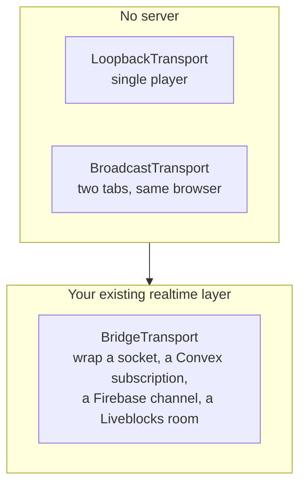

# Integration

One interface, six methods. Implement it against what you already run.

```ts
interface WorkOSAdapter {
  getViewer(): Promise<OccupantRecord>
  listOccupants(): Promise<OccupantRecord[]>
  subscribeOccupants(handler: (occupants: OccupantRecord[]) => void): Unsubscribe
  subscribeActivity(handler: (signal: ActivitySignal) => void): Unsubscribe
  report(signal: WorldSignal): void
  saveLayout?(objects: unknown): Promise<void>
}
```

---

## Step 1: map your people onto occupants

The only work here is deciding what counts as a body.

```ts
function toOccupant(user: User): OccupantRecord {
  return {
    id: user.id,
    name: user.displayName,
    kind: user.isAgent ? "agent" : "human",
    role: user.title ?? user.specialism,
    presence: user.online ? (user.busy ? "busy" : "online") : "offline",
    zoneId: zoneForTeam(user.teamId),
    deskId: user.deskId,
  }
}
```

Do not build an avatar editor on day one. Derived looks from the id are stable and free, and nobody
asks for a customiser until they have already enjoyed the room.

---

## Step 2: bind rooms to channels

```ts
const world = generateOffice({
  seed: workspace.id,
  rooms: [
    { name: "Platform", kind: "pod", binding: `channel:${channels.eng}` },
    { name: "Commerce", kind: "pod", binding: `channel:${channels.sales}` },
    { name: "Boardroom", kind: "meeting", binding: `channel:${channels.leadership}` },
    { name: "Lounge", kind: "lounge", binding: `channel:${channels.random}` },
  ],
})
```

Then act on the crossing:

```ts
report(signal) {
  if (signal.kind === "entered-zone" && signal.binding?.startsWith("channel:")) {
    void joinChannel(signal.binding.slice("channel:".length))
  }
  if (signal.kind === "left-zone" && signal.binding?.startsWith("channel:")) {
    void leaveChannel(signal.binding.slice("channel:".length))
  }
}
```

That one mapping is the feature. Everything after it is decoration.

---

## Step 3: push activity in

Whatever your agents already emit, turn it into a signal.

```ts
subscribeActivity(handler) {
  return onAgentEvent((event) => {
    switch (event.type) {
      case "message":
        handler({ kind: "say", occupantId: event.agentId, text: event.text })
        break
      case "task_started":
        handler({ kind: "status", occupantId: event.agentId, text: event.summary })
        handler({ kind: "sit", occupantId: event.agentId })
        break
      case "standup":
        handler({ kind: "summon", occupantId: event.agentId, zoneId: "zone-4-meeting" })
        break
      case "idle":
        handler({ kind: "roam", occupantId: event.agentId })
        break
    }
  })
}
```

Keep bubbles short. A speech bubble wraps at 22 characters and clamps at 4 lines, because a wall of
text over someone's head stops being a room and starts being a log viewer.

---

## A worked example: Convex and React

```tsx
// officepodz-adapter.ts
import { ConvexReactClient } from "convex/react"
import type { OccupantRecord, WorkOSAdapter } from "@officepodz/core"
import { api } from "./convex/_generated/api"

export function createConvexAdapter(convex: ConvexReactClient, userId: string): WorkOSAdapter {
  return {
    async getViewer() {
      const user = await convex.query(api.users.get, { userId })
      return toOccupant(user)
    },
    async listOccupants() {
      const [users, agents] = await Promise.all([
        convex.query(api.users.listOnline, {}),
        convex.query(api.agents.list, {}),
      ])
      return [...users.map(toOccupant), ...agents.map(toAgentOccupant)]
    },
    subscribeOccupants(handler) {
      // Convex subscriptions already push. Just forward them.
      return convex.onUpdate(api.presence.roster, {}, (roster) => {
        handler(roster.map(toOccupant))
      })
    },
    subscribeActivity(handler) {
      return convex.onUpdate(api.activity.recent, {}, (events) => {
        for (const event of events) {
          handler({ kind: "status", occupantId: event.agentId, text: event.summary })
        }
      })
    },
    report(signal) {
      if (signal.kind === "entered-zone") {
        void convex.mutation(api.presence.enterRoom, {
          userId,
          room: signal.binding ?? signal.zoneId,
        })
      }
      if (signal.kind === "spoke") {
        void convex.mutation(api.chats.sendUserMessage, {
          channel: signal.zoneId,
          text: signal.text,
        })
      }
    },
  }
}
```

```tsx
// OfficePage.tsx
import { useMemo } from "react"
import { OfficePodzCanvas } from "@officepodz/core/react"

export function OfficePage({ userId }: { userId: string }) {
  const convex = useConvex()
  // Memoise the adapter. A new object identity on every render tears the
  // office down and rebuilds it.
  const adapter = useMemo(() => createConvexAdapter(convex, userId), [convex, userId])

  return (
    <OfficePodzCanvas
      adapter={adapter}
      seed="acme-hq"
      style={{ height: "70vh", border: "1px solid var(--line)" }}
      onZoneChanged={({ zoneId }) => setActiveChannel(zoneId)}
      onInteract={({ interaction }) => {
        if (interaction === "presentation") openWhiteboard()
      }}
    />
  )
}
```

---

## Multiplayer

Three options, in increasing order of effort.



```ts
const transport = new BridgeTransport(
  myUserId,
  (message) => socket.emit("officepodz", message),
  (handler) => {
    socket.on("officepodz", handler)
    return () => socket.off("officepodz", handler)
  },
)
```

Do not add a second connection. If your application already has one, wrap it.

---

## Persistence

Store a seed and a diff, not a map.

```ts
import { diffLayout, applyLayoutDiff, generateOffice } from "@officepodz/core"

// On save
const diff = diffLayout(generateOffice({ seed }), engine.map.toJSON())
await saveToDatabase({ seed, diff })

// On load
const stored = await loadFromDatabase()
const world = applyLayoutDiff(generateOffice({ seed: stored.seed }), stored.diff)
```

A rearranged sofa is a few bytes. A whole floor plan is 30 kB.

---

## Checklist before you ship it to a team

- [ ] Occupants have stable ids. Regenerated ids mean regenerated faces.
- [ ] The adapter object identity is stable across renders.
- [ ] Room bindings point at channels that actually exist.
- [ ] `report` is cheap and never throws. It runs on zone crossings.
- [ ] Agent bubbles come from real activity, not from a random generator.
- [ ] The canvas has a defined height. A zero height canvas renders nothing.
