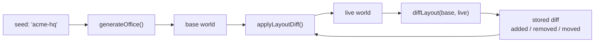

# World format

`WorldData` is plain JSON. No classes, no canvas, no host coupling. Store it, diff it, hand edit it,
or throw it away and regenerate from the seed.

---

## Shape

```jsonc
{
  "version": 1,
  "name": "OfficePodz HQ",
  "seed": "acme-hq",
  "width": 51,              // tiles
  "height": 19,
  "floor": [1, 1, 1, ...],  // row major tile ids, length width * height
  "walls": [8, 8, 0, ...],  // 0 means no wall
  "zones": [ ... ],
  "objects": [ ... ],
  "spawn": { "x": 25, "y": 9 }
}
```

Tile ids index `TILE_KINDS`:

| id | kind | id | kind |
|----|------|----|------|
| 0 | void | 6 | checker |
| 1 | carpet-green | 7 | grass |
| 2 | carpet-blue | 8 | wall |
| 3 | carpet-grey | 9 | wall-glass |
| 4 | wood | 10 | wall-brick |
| 5 | concrete | | |

`void`, `wall`, `wall-glass` and `wall-brick` block movement. Everything else is walkable unless a
solid object sits on it.

---

## Zones

```jsonc
{
  "id": "zone-4-meeting",
  "name": "Boardroom",
  "kind": "meeting",
  "rect": { "x": 40, "y": 0, "w": 11, "h": 8 },
  "binding": "channel:leadership",
  "capacity": 6,
  "accent": "#2f6db5"
}
```

Zones may overlap. `zoneAt` walks the list in reverse, so a room placed after a corridor wins on the
tiles they share.

---

## Objects

```jsonc
{ "id": "obj-12", "kind": "desk", "x": 3, "y": 2, "zoneId": "zone-0-pod", "ownerId": "agent-winston", "seed": 4821 }
```

`x` and `y` are the top left of the footprint. `seed` varies the art details, so two desks in a row
are not pixel identical.

---

## Generating

```bash
npm run world -- --seed acme-hq --pods 6 --out assets/world-acme.json
```

```ts
const world = generateOffice({
  seed: "acme-hq",
  pods: 6,
  roomWidth: 11,      // odd numbers centre doors neatly
  roomHeight: 8,
  corridorHeight: 3,
})
```

Or describe a real floor plan:

```ts
generateOffice({
  seed: "acme-hq",
  rooms: [
    { name: "Platform", kind: "pod", binding: "channel:eng", capacity: 8 },
    { name: "Commerce", kind: "pod", binding: "channel:sales" },
    { name: "Boardroom", kind: "meeting", binding: "channel:leadership" },
    { name: "Lounge", kind: "lounge" },
    { name: "Server Room", kind: "server" },
  ],
})
```

Rooms are laid out in two rows either side of the corridor, in the order given. Half go up, half go
down.

---

## The layout

```
  x=0                                                              x=width-1
  ┌───────────┬───────────┬───────────┬───────────┬───────────┐   y=0
  │           │           │           │           │           │
  │  room 0   │  room 1   │  room 2   │  room 3   │  room 4   │
  │           │           │           │           │           │
  └─────┬─────┴─────┬─────┴─────┬─────┴─────┬─────┴─────┬─────┘   y=roomHeight-1
  ══════╪═══════════╪═══════════╪═══════════╪═══════════╪══════   corridor
  ┌─────┴─────┬─────┴─────┬─────┴─────┬─────┴─────┬─────┴─────┐
  │  room 5   │  room 6   │  room 7   │  room 8   │  room 9   │
  └───────────┴───────────┴───────────┴───────────┴───────────┘   y=height-1

  │ = a door punched through the corridor facing wall
```

Rooms share walls: room `i` starts at `x = i * (roomWidth - 1)`. The plan stays tight and the
collision grid stays small.

---

## Runtime view

`Tilemap` wraps `WorldData` and owns the derived state:

```ts
const map = new Tilemap(world)

map.walkable(12, 4)          // collision, walls plus solid furniture
map.zoneAt(12, 4)            // which room is this
map.objectAt(12, 4)          // topmost object covering the tile
map.nearestWalkable(12, 4)   // breadth first spawn repair
map.addObject(object)        // rebuilds collision
map.toJSON()                 // back to plain data
```

Collision is rebuilt in one pass after any edit. At a few thousand tiles that costs nothing and
removes a class of stale index bug.

---

## Persistence strategy

Do not store the map.



```ts
const diff = diffLayout(generateOffice({ seed }), engine.map.toJSON())
// { added: [...], removed: ["obj-4"], moved: [...] }
```

A team that moved three things stores three things. Regenerating from the seed also means an upgrade
to the generator reaches everyone, while their rearranged sofa stays where they put it.

---

## Hand editing

The JSON is meant to be edited. Common moves:

- Change a room's `binding` to point at a different channel.
- Change `accent` to recolour a room's floor label.
- Add an object: pick a `kind` from the catalogue, set `x` and `y`, give it any unique `id`.
- Carve a door: set `walls[y * width + x]` to `0` and `floor[...]` to a walkable tile.

Then call `map.rebuild()`, or just reload. There is no cache to invalidate beyond the collision grid.
