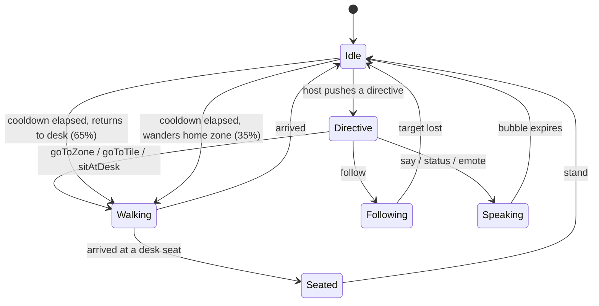
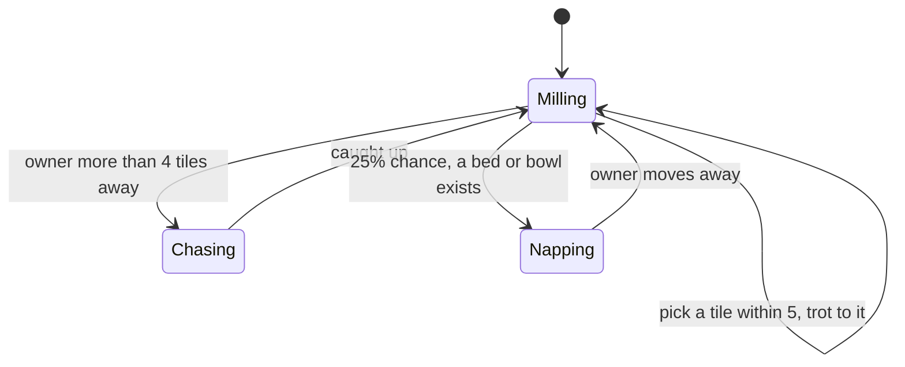

# Agents and pets

What moves on its own, and the rule that keeps it honest.

---

## The rule

**A brain never invents facts about the business.**

It decides where a body should stand and when to idle. What an agent says, what it is working on and
who it reports to comes from the host through directives. The moment a brain starts generating
plausible sounding status text, the office becomes a second source of truth and every reading of it
is suspect.

Pets are the deliberate exception, and they are safe precisely because they mean nothing. A cat
napping under a desk is atmosphere. A cat that implies inventory is fine is a bug.

---

## Agent brain



Priority order, highest first:

1. A queued directive.
2. An active follow target.
3. Currently walking or seated: do nothing.
4. Cooldown, 3 to 11 seconds, then return to the desk or wander.

That 65 percent bias towards the desk is what makes a room full of agents read as populated rather
than as a screensaver. Pure wandering looks like a demo. Returning to a desk looks like work.

---

## Directives

```ts
engine.direct("agent-winston", { type: "status", text: "reconciling par levels" })
engine.direct("agent-winston", { type: "sitAtDesk" })
```

| Directive | Fields | Effect |
|-----------|--------|--------|
| `goToZone` | `zoneId` | Path to a random free tile in the room |
| `goToTile` | `tile` | Path to an exact tile |
| `sitAtDesk` | `objectId?` | Route to the seat, sit, face the desk. Re-queues itself until it arrives |
| `follow` | `targetId` | Shadow another occupant, re-pathing when more than 2.5 tiles away |
| `say` | `text`, `seconds?` | White bubble with a tail, 6s default |
| `status` | `text`, `seconds?` | Dark chip, 10s default |
| `emote` | `text`, `seconds?` | Short, large, 3s default |
| `wander` | | Drift around the home zone |
| `stand` | | Leave the seat, stop |

`sitAtDesk` re-queuing itself is worth noting: it fires, discovers it is not at the seat yet, starts
walking and pushes itself back onto the queue. On the next tick it is at the seat and sits. No state
machine, no arrival callback.

---

## Pet brain



Pets have three poses (`stand`, `step`, `sleep`) rather than a full walk cycle, and they reuse the
profile sprite for every direction. At 16 pixels a profile silhouette reads instantly while a front
facing animal turns into a blob, which is the same trick every 16 bit game used.

A pet naps automatically after about 6 seconds of standing still, which costs nothing and is the
single highest return detail in the whole package.

```ts
engine.addOccupant({
  id: "pet-mochi",
  name: "Mochi",
  kind: "pet",
  presence: "online",
  petKind: "cat",        // cat | dog | bird | robot | plantpal
  ownerId: "agent-donna",
})
```

---

## Writing your own brain

```ts
import type { Brain, BrainContext, Directive } from "@officepodz/core"

class PatrolBrain implements Brain {
  private queue: Directive[] = []
  private index = 0

  constructor(private readonly route: { x: number; y: number }[]) {}

  push(directive: Directive) {
    this.queue.push(directive)
  }

  update(character, ctx: BrainContext, dt: number) {
    if (this.queue.length > 0) {
      // Host directives always win.
      return
    }
    if (character.moving) return
    this.index = (this.index + 1) % this.route.length
    character.walkTo(ctx.map, this.route[this.index], { occupied: ctx.occupied })
  }
}
```

`BrainContext` gives you the map, the current time, the seeded RNG, every character, and the set of
tiles occupied by standing characters. Use the shared RNG rather than `Math.random` if you want
reproducible behaviour.

---

## Crowd behaviour

Standing characters are **soft** obstacles in the pathfinder: cost 4 instead of blocked. A corridor
full of people routes around itself. Hard collisions look correct for one frame and then deadlock,
which is worse than two sprites briefly overlapping.

---

## Desks

The engine hands out unowned desks to agents as they arrive, first come first served, unless the
host supplies `deskId` on the occupant record. Set it from your own data if you want a named seating
plan, which teams ask for roughly ten minutes after they first see the office.
