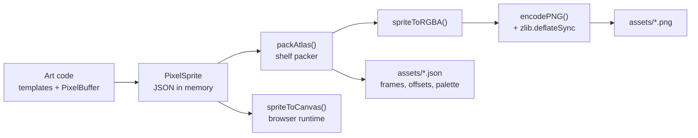

# Asset pipeline

From code to committed PNG, with no image library anywhere.



---

## Commands

| Command | Output |
|---------|--------|
| `npm run assets` | `assets/tiles.png`, `furniture.png`, `pets.png`, `avatars.png` plus JSON manifests |
| `npm run preview` | `assets/preview.png`, a whole office rendered headless |
| `npm run sheet` | `assets/sheet.png`, the contact sheet of every sprite |
| `npm run world` | `assets/world-<seed>.json` |
| `npm run check:art` | Validates every sprite the pack can produce |
| `npm run check:palette` | Fails on banned colours |

Scripts are plain `.mjs` and run against the compiled output in `dist/`, so they need no TypeScript
loader and behave identically in CI and on a laptop.

---

## The PNG encoder

Written out longhand in `src/pixel/png.ts`, roughly 100 lines: CRC32, Adler32, chunk framing, and a
zlib container.

It exists because the whole point of this package is to drop into someone else's stack, and a native
image dependency is exactly the thing that makes that hard. The tradeoff is deliberate:

| Context | Compression | Why |
|---------|-------------|-----|
| Browser | deflate **stored** blocks | Zero dependencies. A few kilobytes is nothing at runtime. |
| Node build scripts | `zlib.deflateSync(level 9)` | Committed assets stay small. Pixel art compresses about 30 to 1. |

`encodePNG` takes an optional `deflate` function. That single seam is the whole arrangement.

Scanlines use filter type 0. Pixel art has long flat runs, so a smarter filter buys almost nothing
while making the output harder to verify by hand.

---

## Atlases

A row based shelf packer. Deliberately simple: sprite counts are in the hundreds, not the thousands,
and a stable layout means the exported PNG changes only when the art changes. A byte identical
rebuild is what makes an asset diff meaningful in a pull request.

The manifest is the contract:

```jsonc
{
  "name": "furniture",
  "width": 251,
  "height": 73,
  "palette": ["#00000000", "#10140f", ...],
  "frames": {
    "furniture-desk": { "name": "furniture-desk", "x": 1, "y": 1, "w": 32, "h": 26, "originY": 10 }
  }
}
```

Anything that can read a texture atlas can use these, including engines that are not this one. If
you would rather drive OfficePodz art from Phaser, Pixi or a Unity importer, the PNG plus this JSON
is all you need.

---

## Headless rendering

`npm run preview` runs the same painter's algorithm as the canvas renderer, in Node, and writes a
PNG. It exists for one reason: **an art regression becomes an image diff in a pull request** rather
than a bug report from whoever opened the app next.

```
Floor pass
  ↓
Walls, furniture and characters into one list keyed by bottom edge
  ↓
Sort, paint, upscale, encode
```

The one thing headless rendering must do that the browser gets for free: composite in RGBA.
Sprites carry their own palettes, so copying palette indices between sprites silently reinterprets
the colours. `RgbaCanvas` in `scripts/lib.mjs` handles it.

---

## CI guards

Two scripts, both cheap, both worth running on every pull request.

**`check:art`** validates every sprite the pack can produce: row counts, row widths, palette
references, sprite sizes against the furniture catalogue, and seat offsets that are adjacent to their
footprint. Hand authored templates are strings, and a string can be one character short without
anyone noticing until a sprite renders with a seam.

**`check:palette`** walks every colour in the base palette, the skin ramps, the hair ramps, the
outfit ramps and the trousers, and fails on anything in the 265 to 335 hue band with real saturation.
The brand rule is "no purple". This is that rule as code rather than as a comment nobody reads.

```yaml
# .github/workflows/ci.yml
- run: npm run build
- run: npm run check:palette
- run: npm run check:art
- run: npm run preview && git diff --exit-code assets/preview.png
```

That last line turns any unintended art change into a failed build.
